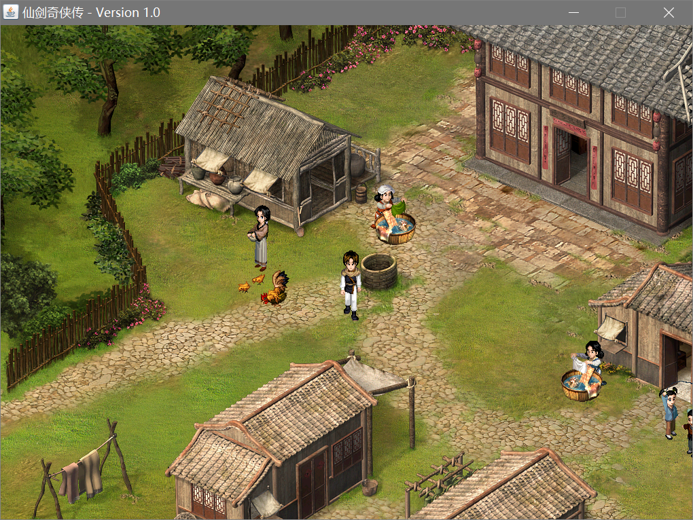
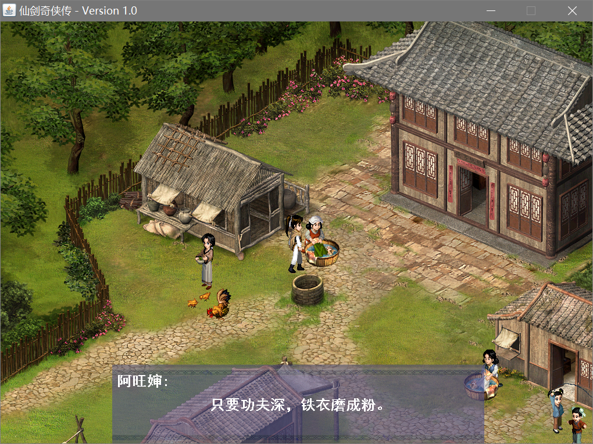
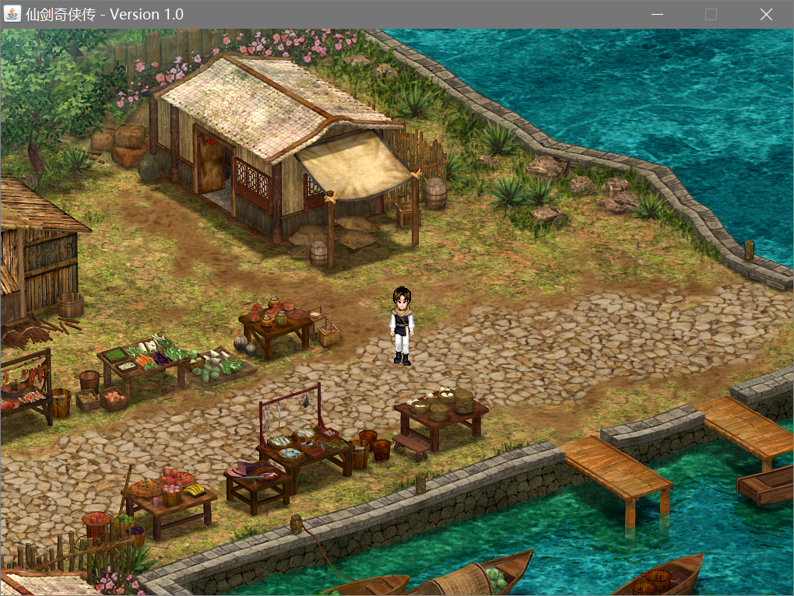

# 操作方式

- 方向键控制角色上下左右移动
- 空格键与npc对话
- ESC键退出对话或退出游戏
- 回车键切换场景(切换位置在地图最右侧小路尽头)

---

# 效果截图

---

# 实现思路

1. 静态页面（窗口 画板 场景 角色）

2. 配角运动效果

3. 主角运动效果

4. 主角的功能效果
    - 障碍物（通过redmap来判断障碍物）
    - 回车键切换场景
    - 控制不同配角之间的运动速度
